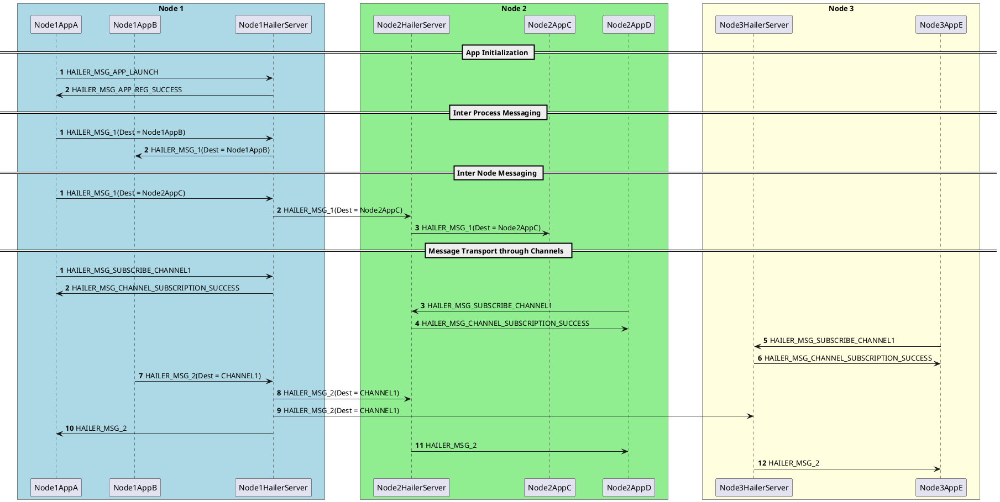

# Hailer

This repo contains the source code for Hailer server application and Hailer library(hailer.so)

# About Hailer

Hailer is an inter-node message transportation framework which is developed for sending and recieving messages between devices which are connected to the same Local Area Network. 

Hailer consists of a server application which runs in all nodes that needs to use the common communication framework.The main function of the hailer server is to listen to messages from aplplications running in the same node or nodes connected to the same LAN and route those messages to correct desitnation which might be inside or outside of the node in which the server application runs.

Hailer also provides a library which contains various APIs which can be used by the applications to send messages to other applications within the same node or other nodes in the same network in which a hailer server runs.

# Main features of Hailer
- Provides a inter-process communication mechanism to send messages between applications running in the same node.
- Provides a inter-node communication mechanism to send messages between nodes in the same LAN.
- Provides a node discovery mechanism which help each node in the network to be aware of other nodes, their capabilities and other informations.
- Provides a library which helps Applications using hailer to register with hailer server, send and recieve messges.

# Message sequence diagram

